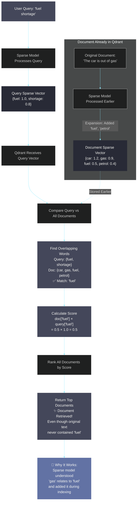

```mermaid
graph TD
%%{init: {'theme':'dark', 'themeVariables': {'darkMode':true,'background':'#282a36','primaryColor':'#bd93f9','primaryTextColor':'#f8f8f2','primaryBorderColor':'#6272a4','lineColor':'#8be9fd','secondaryColor':'#44475a','tertiaryColor':'#6272a4','fontSize':'20px','fontFamily':'monospace'}, 'flowchart':{'htmlLabels':true, 'curve':'basis', 'padding':25, 'nodeSpacing':80, 'rankSpacing':100}}}%%
    Start[User Query: 'fuel shortage'] --> QueryModel[Sparse Model Processes Query]
    
    QueryModel --> QueryVector["Query Sparse Vector<br/>{fuel: 1.0, shortage: 0.8}"]
    
    QueryVector --> Qdrant[Qdrant Receives Query Vector]
    
    subgraph "Document Already in Qdrant"
        OriginalDoc["Original Document:<br/>'The car is out of gas'"]
        DocModel[Sparse Model Processed Earlier]
        DocVector["Document Sparse Vector<br/>{car: 1.2, gas: 0.9, fuel: 0.5, petrol: 0.4}"]
        
        OriginalDoc --> DocModel
        DocModel -->|Expansion: Added 'fuel', 'petrol'| DocVector
    end
    
    Qdrant --> Compare[Compare Query vs All Documents]
    DocVector -.Stored Earlier.-> Compare
    
    Compare --> Overlap["Find Overlapping Words<br/>Query: {fuel, shortage}<br/>Doc: {car, gas, fuel, petrol}<br/>✅ Match: 'fuel'"]
    
    Overlap --> Score["Calculate Score<br/>doc['fuel'] × query['fuel']<br/>= 0.5 × 1.0 = 0.5"]
    
    Score --> Ranking[Rank All Documents by Score]
    
    Ranking --> Result["Return Top Documents<br/>✨ Document Retrieved!<br/>Even though original text<br/>never contained 'fuel'"]
    
    Result --> Magic["🎯 Why It Works:<br/>Sparse model understood<br/>'gas' relates to 'fuel'<br/>and added it during indexing"]
    
    style Start fill:#44475a,stroke:none,color:#f8f8f2
    style Result fill:#44475a,stroke:none,color:#f8f8f2
    style Magic fill:#6272a4,stroke:none,color:#f8f8f2
    style Overlap fill:#44475a,stroke:none,color:#f8f8f2
    style QueryVector fill:#282a36,stroke:none,color:#f8f8f2
    style DocVector fill:#282a36,stroke:none,color:#f8f8f2
    style Score fill:#44475a,stroke:none,color:#f8f8f2

```

